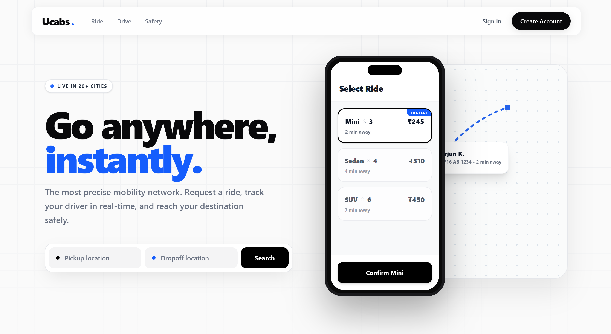
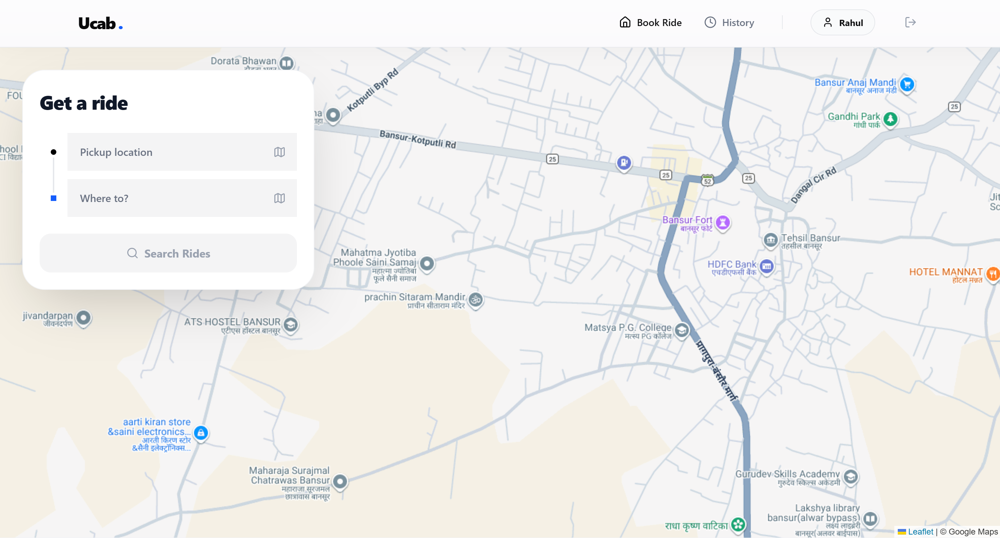
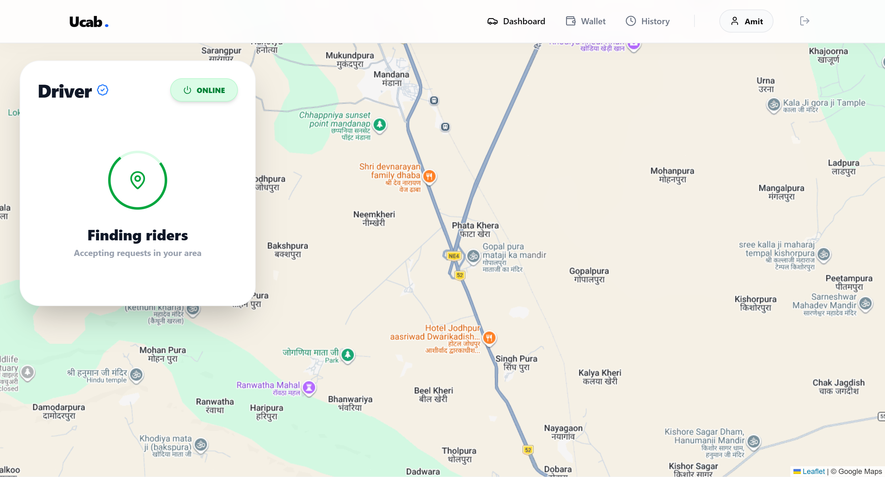
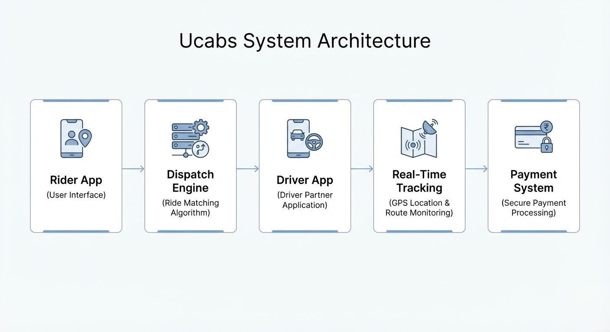

<div align="center">

<h1 align="center">Ucabs.</h1>

<p align="center">
<strong>Engineering the physical mobility infrastructure of tomorrow, today.</strong>
</p>

<p align="center">
<a href="https://reactjs.org/">

</a>

<a href="https://tailwindcss.com/">

</a>

<a href="https://nodejs.org/">

</a>

<a href="https://socket.io/">

</a>

<a href="https://www.mongodb.com/">

</a>
</p>

</div>

---

# 🌐 Overview

**Ucabs** is a high-performance full-stack mobility platform that connects digital ride requests with real-world driver networks. The platform features real-time GPS tracking, algorithmic ride dispatching, and a dedicated driver partner system.

This project replicates **Tier-1 ride-hailing architectures** (similar to Uber/Lyft) and implements complete workflows for:

- Riders  
- Drivers  
- Admin verification  
- Real-time dispatch and tracking  

---

# 📸 Application Screenshots

## 🚀 Landing Page

<div align="center">

<p><em>Modern landing page with ride booking interface.</em></p>
</div>

---

## 👤 Rider Dashboard

<div align="center">

<p><em>User dashboard displaying vehicle options and pricing.</em></p>
</div>

---

## 🚘 Driver Dashboard

<div align="center">

<p><em>Driver interface for accepting rides and navigating trips.</em></p>
</div>

---

## 🗺 Ride Booking & Live Tracking

<div align="center">

<p><em>Real-time ride booking and GPS route tracking.</em></p>
</div>

---

# ✨ Core Architecture & Features

### 🚖 Frictionless Booking Engine
A progressive booking interface powered by **Framer Motion** that allows users to select pickup and drop-off locations with dynamic fare estimation.

### 📡 Real-Time Telemetry
Live ride synchronization between riders and drivers using **Socket.io**.

### 🗺 Advanced Geolocation
Integration with **TomTom Maps API** for:

- Reverse geocoding  
- Address auto-completion  
- Route calculation  
- Distance estimation  

### 🔐 OTP Trip Verification
Each trip starts with a **4-digit OTP verification** to ensure secure ride initiation.

### 👨‍✈️ Driver Partner Dashboard
Drivers can:

- Accept ride requests  
- Navigate routes  
- Manage trip status  
- Track earnings  

### 🎨 Premium UI/UX
Designed using **Tailwind CSS** with:

- Glassmorphism UI  
- Mobile bottom sheets  
- Hardware accelerated animations  
- Clean Inter typography  

---

# 🛠 Tech Stack

## Frontend
- React 18 + Vite  
- Tailwind CSS  
- Framer Motion  
- Lucide React Icons  
- React Context API  
- Axios  
- Leaflet / React-Leaflet  
- TomTom Maps API  

## Backend
- Node.js  
- Express.js  
- MongoDB  
- Mongoose  
- Socket.io  
- JWT Authentication  
- bcrypt  

---

# 🚀 Getting Started (Local Development)

Follow these steps to run **Ucabs locally**.

---

## 📦 Prerequisites

Install the following:

- Node.js (v16 or higher)  
- MongoDB (local instance or Atlas)  
- TomTom Maps API Key  

Resources:

https://nodejs.org  
https://mongodb.com  
https://developer.tomtom.com  

---

# 1️⃣ Clone the Repository

```bash
git clone https://github.com/tauqeeralam11/UCabs.git
cd UCabs
```

---

# 2️⃣ Setup Backend

Navigate to the backend folder.

```bash
cd backend
npm install
```

Create `.env` file inside **backend**.

```
PORT=5000
MONGODB_URI=mongodb://localhost:27017/ucabs_db
JWT_SECRET=your_super_secret_jwt_key
```

Start the backend server.

```bash
npm run dev
```

Backend will run at:

```
http://localhost:5000
```

---

# 3️⃣ Setup Frontend

Open a new terminal window.

```bash
cd frontend
npm install
```

Create `.env` file inside **frontend**.

```
VITE_TOMTOM_API_KEY=your_tomtom_api_key_here
```

Start the frontend server.

```bash
npm run dev
```

Frontend runs at:

```
http://localhost:5173
```

---

# 📱 User Workflows to Test

To fully experience the real-time matching engine, open **three browser windows (or incognito tabs).**

---

## 1️⃣ Rider Experience (Window 1)

1. Register as a **User**
2. Navigate to the **Ride booking section**
3. Enter pickup and drop-off location
4. Select vehicle tier (**Mini, Sedan, SUV**)
5. Click **Request Ride**

The platform begins searching for nearby drivers.

---

## 2️⃣ Driver Partner Experience (Window 2)

1. Open a new **incognito window**
2. Register as a **Driver**
3. Upload **KYC documents** (mock images are fine)
4. Submit verification request

⚠️ Driver cannot go online until **admin verification is completed.**

---

## 3️⃣ Admin Workflow & Driver Verification (Window 3)

This step activates the driver created above.

### Local Admin Setup Tip

To create an admin locally:

1. Register a normal user account
2. Open **MongoDB Compass**
3. Locate the **users collection**
4. Change the role field from:

```
"user" → "admin"
```

---

### Admin Approval Process

1. Login using the **Admin account**
2. Navigate to **Admin Dashboard**
3. Open **Pending Driver Approvals / KYC Requests**
4. Review submitted driver details
5. Click **Approve Driver**

---

# 🚖 Completing a Ride

1. Return to **Window 2 (Driver)** and refresh
2. Toggle driver status **Online**
3. Ride request from Window 1 appears
4. Driver accepts the ride

---

### OTP Trip Verification

1. Rider provides the **4-digit OTP**
2. Driver enters OTP to start trip

---

### Trip Completion

1. Driver reaches destination
2. Driver ends trip
3. Rider completes **payment (mock flow)**

---

# 🤝 Contributing

Steps to contribute:

1. Fork the repository
2. Create a feature branch

```bash
git checkout -b feature/AmazingFeature
```

3. Commit changes

```bash
git commit -m "Add AmazingFeature"
```

4. Push branch

```bash
git push origin feature/AmazingFeature
```

5. Open Pull Request

---

# 📄 License

Distributed under the **MIT License**.

See `LICENSE` for more details.
